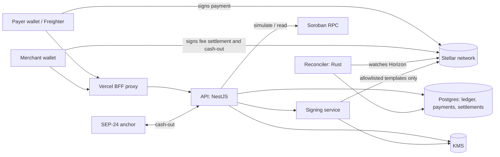

# Target architecture

**Scope:** the design that the recommended choices in [docs/specs/](../specs/README.md) require. It covers money rules, fees, custody and keys, the network profiles, and the operational controls around them.
**Status:** proposal. Items marked *existing* already run in the codebase. Items marked *new* are what the specs add.

## 1. Principles

1. **One definition of each money rule.** A fee, a rounding rule, or a payment verdict is written once and tested against shared vectors in both TypeScript and Rust. Today the fee and asset rules are duplicated across the two languages, with a comment asking for them to match. That is the drift the audit found.
2. **Money moves only by ledger entry.** Every balance change is an append-only entry with a reference to its on-chain transaction. Reports, dashboards, and reconciliation read the ledger. They never recompute from payment rows.
3. **Konfirm never holds a merchant's key.** Merchants sign their own transactions, in Freighter, for every outbound movement: fee settlement and cash-out.
4. **Hot keys are isolated and rate-limited.** Anything Konfirm signs goes through a signing boundary that enforces a template allowlist and caps, not through application code.
5. **Fail closed on money, fail open on screening.** Matches the current policy: a hold is safer than a credit, and an unreachable compliance check does not block checkout, but is logged loudly.
6. **Network is configuration, not code.** A network profile supplies every identifier. A boot check refuses to start if any is missing.

## 2. Context



## 3. Components

### 3.1 Money core (new)

A small library, `money-rules`, with no I/O:

- `feeFor(amount, policy) -> fee`, where a policy is `{ rate_bps, floor_minor, promo }`.
- `owedFee(amount, rate_bps)`: rounds down to a stroop.
- `verdict(expected, observed) -> { status, reason }`: the payment check, including the PWYW session amount (spec 5).
- `totalFor(amount, policy)`: what a checkout displays.

The library ships as a JSON file of **golden vectors** (input, expected output) that both the Node and Rust test suites load. A change to a rule must change a vector, which makes a drift a failing test, not a comment. In the repo this is a `money-rules/` directory consumed by `konfirm-backend` and by `reconciler`.

*Why:* this removes the duplicated fee and verdict logic that the audit flagged, and gives the pricing decision (spec 1) one place to live.

### 3.2 Fee policy (new, spec 1)

A merchant has a **fee policy** row, not a bare `fee_bps` column:

```
fee_policies(id, merchant_id, rate_bps, floor_minor, asset_scope, effective_from, effective_to, plan)
```

- Existing merchants get a policy row at 10 bps, no floor, effective from the migration date. That is the grandfathering in spec 1.
- New merchants get the new default.
- Policy changes write a new row. The old row is closed, never edited. Each payment stores the policy id it was priced under, so a later change can't rewrite history.
- `plan` is nullable now and reserved for the subscription tier.

Promos (referral) stay as a separate, time-boxed modifier applied on top of the policy, in `money-rules`.

### 3.3 Ledger (new)

```
ledger_entries(id, merchant_id, kind, asset_code, asset_issuer, amount_raw, ref_type, ref_id,
               tx_hash, created_at)
```

`kind` is one of:

| Kind | Meaning | Written by |
|---|---|---|
| `payment_received` | Merchant's gross receipt | Reconciler, on `paid` |
| `fee_accrued` | Fee owed for a payment | Reconciler, when `fee_status = owed` |
| `fee_collected` | Fee taken on-chain at checkout | Reconciler, when the fee leg is present |
| `fee_claimed` | Fee placed into a pending settlement | Fees service |
| `fee_settled` | Fee confirmed on-chain | Fees sweep |
| `fee_released` | Settlement expired, fee back to owed | Fees sweep |
| `cashout_fee` | Fee taken in a cash-out (spec 2) | Withdrawals service |
| `fee_waived` | Admin waiver, with reason | Admin |

Balances are sums, not stored. A **reconciliation job** runs hourly. It compares, per asset, the sum of `fee_*` entries that claim to be on-chain against Horizon's record of payments to the fee account, and alerts on any gap. This is the check that would have caught the missing-fee-leg bypass automatically.

The existing `payments.fee_status` column stays as a fast lookup. It is a projection of the ledger, not the source of truth.

### 3.4 Reconciler (existing, extended)

- Records each payment with its `policy_id`, and writes ledger entries in the same database transaction as the payment row. A payment and its entries commit together or not at all.
- Verdict logic comes from `money-rules`, not local code.
- Session-level `expected_amount` replaces the link amount when the link is PWYW (spec 5).

### 3.5 Settlement and fee services (existing, extended)

- Fee settlement (Option B, built): merchant-signed, submit-what-was-signed, hash-checked. Unchanged in principle.
- Cash-out fee (spec 2): the fee becomes a second operation in the SEP-24 withdrawal transaction. The withdrawals service adds it, and returns the fee in the preview. The same fee rule comes from `money-rules`.
- The sweep runs per asset (spec 4), see 3.7.

### 3.6 Signing boundary (new, the largest architectural change)

Today the facilitator and fee-sweep keys sign inside the API process. The target moves signing into a separate **signing service**:

- It is the only process with access to the KMS key IDs.
- It accepts a request only as one of a fixed set of **templates**: x402 settle, channel open/close, fee sweep per asset, treasury approval. Each template names its allowed destinations, assets, and maximum amounts.
- It enforces the daily spend cap itself, not in the API, so a compromised API can't raise the cap.
- Every signing request is logged with template, amount, and requester, to an append-only table.
- The API calls it over a private network with mutual TLS.

*Why:* today a bug in the API can sign any transaction the in-process key can sign. In the target, the API can ask for an allowed template only, and the blast radius of a compromise is bounded by the template list and the cap.

### 3.7 Treasury and sweeps (new, spec 4)

```
treasury_instances(asset_code, asset_issuer, contract_id, token_contract_id, network, signers_hash, active)
```

- One row per asset. The sweep reads this table, not a constant.
- Each sweep is a settlement proposal on that asset's treasury, approved by two signers, then executed.
- The spend guard counts all assets in USD against the same daily cap. The USD value comes from the same rate source the reconciler uses for XLM and EURC.
- Operating minimums and reserves (for XLM, the account's base reserve) are enforced by the signing service template, not left to the sweep caller.

### 3.8 Keys and custody

| Identity | Custody | Used by | Rule |
|---|---|---|---|
| Merchant | Merchant's wallet | Fee settlement, cash-out | Konfirm never holds it |
| Payer | Payer's wallet | Checkout | Konfirm never holds it |
| Facilitator | KMS, behind the signing service | x402, channels, gas | Spend cap enforced in the signing service |
| Fee account | KMS, behind the signing service | Fee sweep | Sweep template only |
| Deployer | 2-of-3 multisig (spec 3) | Contract admin, deploys | Not in any runtime environment |
| Treasury signers (3) | Three different people, hardware keys | Approving settlements | Two of three to execute; deployer is not one of them |

`STELLAR_DEPLOYER_SECRET_KEY` does not exist in the target. The deployer public address is configuration only.

### 3.9 Network profiles and config (new, spec 6)

```
config/
  networks/testnet.json
  networks/mainnet.json
```

Each profile lists every identifier the system uses: horizon, rpc, passphrase, issuers, SACs, contract ids per asset, anchor endpoints, signer addresses. The profile is validated at boot against a schema. A missing or wrong-typed value stops the process. Secrets (keys, DB URLs) never go in the profile; they come from the secret manager.

The startup log prints the network, the contract ids, and the profile hash, so a wrong deploy is visible on the first line.

### 3.10 Pay-what-you-want (new, spec 5)

- `links` gets a `pricing_mode` (`fixed` | `pwyw`), with `min_minor` and `max_minor`.
- `link_sessions` gets `expected_amount`, set at reserve time for PWYW and equal to the link amount for fixed links.
- The verdict compares the observed payment to `expected_amount`. Fixed links go through the same path, so there is one check, not two.

### 3.11 Edge, auth, and observability

- **Edge:** Vercel BFF in front of the API, with `TRUST_PROXY_HOPS` set to the measured chain (verified in staging, not assumed).
- **Auth:** session cookies as now. Passkeys are a later option for merchants, not a prerequisite.
- **Metrics that matter:** payments by verdict, owed-fee balance per merchant, settlement success rate, sweep amounts per asset, signing requests by template and outcome, reconciler lag in seconds.
- **Alerts:** reconciler lag, reconciliation gap, any signing request denied, any held payment above the pilot cap, any owed balance over a threshold.
- **Logs:** structured, with request ids. Cookies and keys redacted (already in place).

## 4. Key flows

### 4.1 Checkout, Freighter (fee atomic)

1. API prices the payment with `money-rules` and the merchant's policy, and records the policy id on the session.
2. Payer signs one transaction: merchant payment plus fee payment.
3. Reconciler verifies both legs, writes `payment_received`, `fee_collected` in one database transaction.

### 4.2 Checkout, QR (fee owed)

1. Payer scans, pays the link amount only.
2. Reconciler writes `payment_received` and `fee_accrued`, status `paid`.
3. Merchant later settles: API builds the settlement, merchant signs, API submits what was signed, sweep confirms. Ledger moves `fee_accrued` to `fee_claimed` to `fee_settled`.

### 4.3 Cash-out with fee (spec 2)

1. API previews amount, fee (from `money-rules`), and total, and returns the transaction with the fee leg.
2. Merchant signs once. Anchor receives the amount. Fee account receives the fee.
3. Ledger writes `cashout_fee`. The withdrawal record stores the fee.

### 4.4 Treasury sweep (spec 4)

1. Sweep job reads `treasury_instances`, computes per-asset balances above reserves, and asks the signing service for a settlement proposal template.
2. Two signers approve on their own devices. Execute.
3. Ledger writes `fee_settled` per asset once the treasury transfer is confirmed.

## 5. Failure modes and responses

| Failure | Behaviour | Why |
|---|---|---|
| Horizon unreachable | Reads retry; payments wait, no credit | Fail closed on money |
| Compliance contract unreachable | Checkout proceeds, flag on record | Fail open on screening, loudly (current policy) |
| Signing service down | Sweeps and x402 pause; checkout and reads unaffected | Isolation |
| Daily cap reached | Signing halts for all templates until an admin resumes | Current policy |
| Reconciler stalled | Watchdog alerts; payments invisible until it catches up | Current runbook |
| Reconciliation gap found | Alert; payments involved are held for review | Money is wrong until proven right |
| Settlement expired unsigned | Claims released to owed | Current behaviour |

## 6. Migration path

Ordered to match the spec order, so each step is independently useful:

1. **Deployer multisig** (spec 3): operational, no code. Then remove the deployer secret from environments.
2. **Money core and golden vectors** (section 3.1): extract the existing fee and verdict rules, with vectors that match current outputs. No behaviour change. This is the safety net for everything after.
3. **Fee policy table** (3.2): migrate existing merchants to a 10 bps policy row, then add the new default and floor (spec 1).
4. **Ledger** (3.3): start writing entries alongside existing columns. Add the reconciliation job, and run it in shadow mode for two weeks before trusting it.
5. **Cash-out fee** (spec 2, with its anchor spike).
6. **Per-asset treasuries** (spec 4): deploy instances, switch the sweep to the registry.
7. **Signing service** (3.6): move keys behind it template by template, starting with the fee sweep.
8. **PWYW** (spec 5), then **network profiles** (spec 6) and the **audit**, then mainnet.

Steps 1 to 3 are the minimum before any further pricing change. Step 7 is the largest, and it can wait until the sweep volume justifies it, but the template design should be settled first so the sweep is built to fit.

## 7. What this design does not decide

- Subscription billing: the `plan` column is reserved, but billing is its own spec.
- Multi-region hosting and high availability for the reconciler. The current single-process watch loop is adequate for the pilot.
- Whether to replace the Rust reconciler with a second TypeScript implementation. Keep it; the golden vectors make the two agree.
- Contract audit scope, which belongs to spec 6.

## 8. Verification before building

Two claims in this design need a spike before the dependent step starts:

- **Soroban `require_auth` with multisig accounts** (step 1, spec 3). Confirm one signature fails and two succeed on an admin-only call.
- **Anchor acceptance of an extra fee operation** (step 5, spec 2). Confirm the test anchor completes a withdrawal whose transaction carries a second payment.

If either spike fails, the dependent step changes; the rest of the design doesn't.
